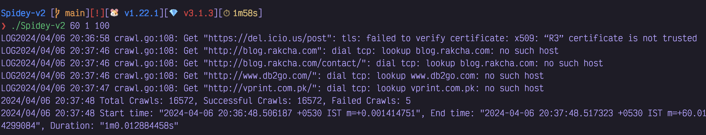

# Spidey-v2

A multithreaded web crawler written in Go.

This is an improved version of [Spidey](/Users/anirudh/Desktop/Spidey_v2_time.png)

## Results

Spidey took 1 minute to crawl 16,572 links



## Usage

1. Clone this repository

```sh
git clone https://github.com/anirudhsudhir/Spidey-v2.git
cd Spidey-v2
```

2. Create a "seeds.txt" and add the seed links in quotes consecutively

    Sample seeds.txt

```text
"http://example.com"
"https://abcd.com"
```

3. Build the project and run Spidey.

   Pass the crawl time, request delay and worker count as arguments.
   - Crawl Time: The time during which Spidey adds new links to the crawl queue in seconds(positive integer)
   - Request Delay: The required delay before a request is sent to a link of the same domain in seconds(positive integer)
   - Worker Count: The number of crawl workers to run concurrently(positive integer)

```sh
go build
./spidey 10 1 5
#Here, the crawl time is 10s, request delay is 1s and worker count is 10
```
